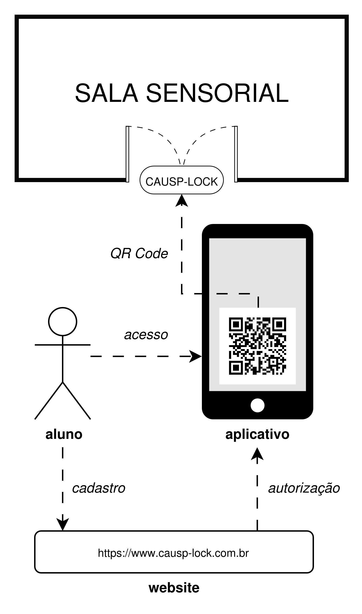
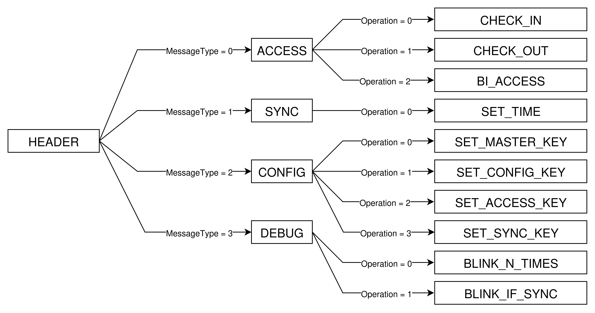
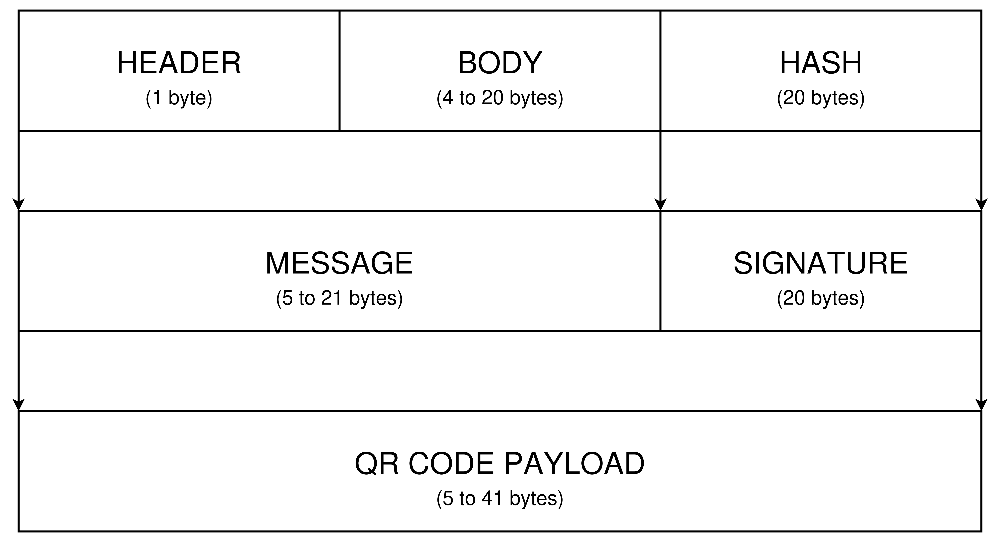
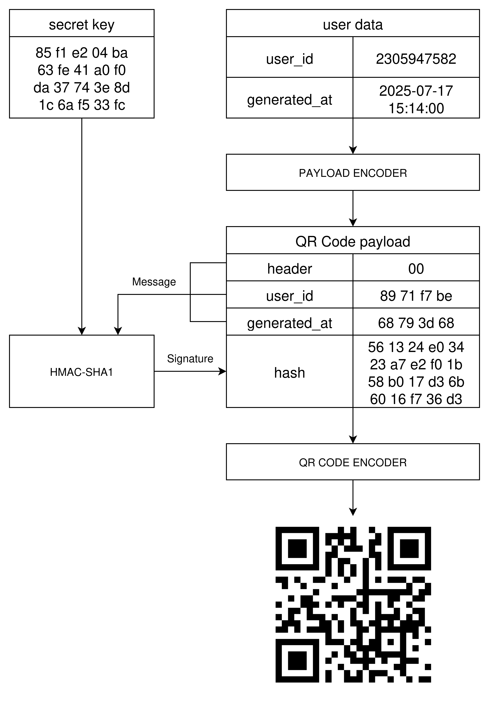

# causp-lock-server

Este repositório contém a API de geração de QR Codes do projeto CAUSP-LOCK.
Trata-se de um sistema de controle de acesso à sala sensorial da Faculdade de Direito da USP, voltada a autistas e neurodivergentes. Na parte física, há uma tranca eletrônica, capaz de ler QR Codes de acesso, por meio de uma câmera OV2640 e um microcontrolador ESP32-CAM. Na parte de software, um website em React permite ao aluno neurodivergente se cadastrar e solicitar acesso à sala, gerando-lhe o QR Code de acesso.

<p align="center">
  
</p>

## Tipos de QR Codes
Há quatro grandes tipos de QR Code:
- **ACCESS**: destinados à entrada e saída, que podem ser CHECK_IN, CHECK_OUT (registrados na memória do ESP32-CAM) ou BI_ACCESS (sem registro, apenas liberação).

- **SYNC**: utilizado para sincronizar o relógio interno do ESP32-CAM com um tempo específico. O nome do QR Code é SET_TIME.

- **CONFIG**: conjunto de QR Codes utilizados para configurar parâmetros e chaves secretas do ESP32-CAM. Para setar as chaves MASTER, ACCESS, SYNC e CONFIG, use os QR Codes SET_MASTER_KEY, SET_ACCESS_KEY, SET_SYNC_KEY e SET_CONFIG_KEY.

- **DEBUG**: utilizados para depuração do ESP32-CAM, o que permite verificar se a leitura dos QR Codes funciona se o dispositivo está sincronizado.

<p align="center">
  
</p>

## Codificação
Os payloads dos QR Codes são divididos em três partes:
- **HEADER**: cabeçalho da mensagem; informa o tipo de QR Code
- **BODY**: corpo da mensagem, contém os dados relevantes à operação
- **HASH**: assinatura digital da mensagem.

O HEADER e o BODY são obrigatórios para todos os tipos de QR Code. Mas, o campo de HASH é opcional nos QR Codes de tipo DEBUG.

<p align="center">
  
</p>

A imagem abaixo ilustra a codificação de QR Code do tipo ACCESS, com a operação CHECK_IN (entrada de cliente na sala, com registro no ESP32-CAM), para um usuário fictício.

<p align="center">
  
</p>

## Codificação em bytes de dados de alto nível
Nesse contexto, dados de alto nível são informações a nível de aplicação, como o identificador único de usuário `user_id`, o tempo em que o QR Code foi gerado `generated_at`, a chave secreta `secret_key`, etc. Por se tratar de um projeto com sistema embarcado, deve-se atentar para detalhes como o tamanho de cada variável em bytes e sua endianness. Para isso, adota-se aqui uma série de convenções que garantem uniformidade da codificação dos dados de alto nível pelas diferentes partes do sistema CAUSP-LOCK.

Por padrão, todos os dados são disposto em little endian. Os identificadores únicos de usuário `user_id` são codificados como `unsigned int` de 32 bits; isso é suficiente para cobrir com grande margem a quantidade de usuários da sala. Os tempos são codificados como `unsigned int` POSIX TIME de 32 bits. Isso, infelizmente, traz o problema de que o sistema pode ter comportamento indefinido a partir de 2038, quando um inteiro de 32 bits não terá mais capacidade suficiente para comportar o POSIX TIME, sofrendo, dessa forma, um overflow possivelmente catastrófico. Mas, a nível de protótipo, isso é suficiente. Para mais detalhes de implementação, verifique a classe `BinaryEncoder` de `qr-code.encoder`.

## Assinaturas Digitais
Os QR Codes do tipo ACCESS, CONFIG e SYNC permitem operações privilegiadas, que deve ser autorizadas pelos administradores do sistema ou realizadas por eles mesmos. Por isso, eles apresentam assinaturas digitais por meio do algoritmo HMAC-SHA1. Ele utiliza uma chave secreta `secret_key` para assinar uma mensagem `message`, gerando uma assinatura digital `hash` de exatamente 20 bytes. Para validar a mensagem, deve-se ter acesso à mesma chave secreta utilizada em sua assinatura; portanto, deve-se protegê-la tanto no ato de sua geração quanto no de sua validação, pois, ao conhecê-la, é possível assinar arbitrariamente qualquer mensagem, o que viola a autenticidade, a integridade e a irretratabilidade do sistema.

Note que utilizou-se aqui o hash SHA1 ao invés do SHA256. A justificativa dessa escolha é que: (i) para o requisito de segurança desejado para a aplicação, o SHA1 já é suficiente; (ii) como o SHA1 possui apenas 20 bytes ao invés dos 32 bytes do SHA256, o payload do QR Code é menor, o que facilita a leitura pela câmera e a decodificação dos dados no ESP32-CAM.

Para assinar digitalmente as mensagens, implementou-se aqui um módulo de assinaturas `auth.signer.py`, com funções de alto nível `sign` e `verify_signature`.

```python
from src.auth.signer import sign

message = b'\xab\xcd\x12\x34'
secret_key = b'\xe7\x8c\xfe\x91\x5a\x88\xde\x83\x50\x3b\x5e\x57\x2a\xae\xb9\x7a\x57\x88\x10\x3d'
signature = sign(message, secret_key)
```

Imprimindo-se o conteúdo, observa-se, conforme o esperado, uma assinatura digital HMAC-SHA1 com 20 bytes de tamanho.

```python
>>> print(signature)
b'x\xca\xd8\xf8b\xfc\x17;\xf7\x8e#[*}K(\xe9\x87@\xce'
```

Pode-se verificar a assinatura com a função `verify_signature`, passando como argumentos a mensagem, a chave secreta e a assinatura recebida. Então, a função computará o hash de `message` concatenado com `secret_key` e verificará se os hashes informado e computado são iguais.

```python
>>> validity = verify_signature(message, secret_key, signature)
>>> print(validity)
True
```

Em caso de qualquer adulteração da mensagem ou da assinatura, a função retornará falso, indicando que a assinatura é falsa. Isso também vale para o caso de as chaves utilizadas na criação e validação serem diferentes. Por exemplo, se adulterarmos a mensagem com

```python
>>> corrupted_message = b'\xfb\xcd\x12\x34'
>>> validity = verify_signature(corrupted_message, secret_key, signature)
>>> print(validity)
False
```

## Chaves secretas
A criação das assinaturas digitais para os QR Codes demanda uma chave secreta, de tamanho arbitrário. Para facilitar sua criação, o módulo `auth.secret_key` implementa funções de alto nível para facilitar a criação e manipulação dessas chaves em código. Para criar uma chave secreta, importe a classe `SecretKey` do módulo `auth.secret_key` e passe uma string hexadecimal.

```python
>>> from src.auth.secret_key import >>> SecretKey
my_secret_key = SecretKey('aa bb cc dd 12 34 56 78')
```

Para visualizar o conteúdo da chave, pode-se dar um print direto.

```python
>>> print(my_secret_key)
00 00 00 00 00 00 00 00 00 00 00 00 aa bb cc dd 12 34 56 78
```

Note que a chave possui endianness little endian e tamanho fixo de 20 bytes, que é uma decisão de projeto. Se for informada uma quantidade de bytes menor que o tamanho fixo da chave, a classe automaticamente a preenche com zeros à esquerda.

Além disso, a classe pode criar chaves pseudo-aleatórias facilmente. Basta chamar o construtor da classe sem passar argumentos.

```python
>>> random_key = SecretKey()
e7 8c fe 91 5a 88 de 83 50 3b 5e 57 2a ae b9 7a 57 88 10 3d
```

Outra alternativa, sem criar uma classe nova, é chamar diretamente o método estático `generate_key()` da classe `SecretKey`, que retorna uma sequência de `length` bytes pseudo-aleatórios (por padrão, 20 bytes) com endianness `byte_order` (por padrão, `'little'`, de little endian), ambos os parâmetros passados como argumentos argumentos opcionais.


```python
>>> random_key = SecretKey.generate_key()
b'pE\x0f\xcf\xafw!7\x17;\xe3\xbc+\x9d\xfcAY\x16\x0e['
```

Os métodos implementados pelos módulos de codificação e autenticação aceitam tanto os bytes puros quanto uma instância da classe `SecretKey` como argumentos, portanto, não é necessário fazer uma conversão explícita de um tipo para o outro.

## Gerador de QR Codes
A biblioteca `qr_code` permite a geração de QR Codes a partir de dados de alto nível, graças ao módulo `encoder.py` e ao `generator.py`, responsáveis, respectivamente, pela codificação dos dados em bytes puros, para composição do payload do QR Code, e pela geração das imagens `.png` ou `.jpg` dos QR Codes, para uso pelo usuário.

Por exemplo, para criar, um QR Code CHECK_IN, importe os módulos `qr_code.generator`, `qr_code.encoder`, crie uma chave secreta com `SecretKey` ou bytes puros, e crie uma instância da classe `QR_CODE_CHECK_IN`, com os dados, conforme o exemplo abaixo.

```python
from auth.secret_key import SecretKey
from qr_code.generator import *
from qr_code.encoder import *

access_key = SecretKey('85 f1 e2 04 ba 63 fe 41 a0 f0 da 37 74 3e 8d 1c 6a f5 33 fc')

qrcode_check_in = QRCODE_CHECK_IN(
    user_id=2305947582,
    generated_at=datetime(year=2025, month=7, day=17, hour=15, minute=14),
    access_key=SecretKey('85 f1 e2 04 ba 63 fe 41 a0 f0 da 37 74 3e 8d 1c 6a f5 33 fc')
)
```

Para ver o conteúdo do QR Code gerado, pode-se dar um print nele diretamente.

```python
>>> print(qrcode_check_in)
QR Code Info
action: CHECK_IN
user_id: 2305947582
generated_at: 2025-07-17 15:14:00
access_key: 85 f1 e2 04 ba 63 fe 41 a0 f0 da 37 74 3e 8d 1c 6a f5 33 fc 
payload: 00 89 71 f7 be 68 79 3d 68 56 13 24 e0 34 23 a7 e2 f0 1b 58 b0 17 d3 6b 60 16 f7 36 d3 
```

Para gerar a imagem do QR Code, basta usar o método `save_qrcode` do próprio objeto, passando no argumento `path` o diretório em que a imagem será salva e o nome do arquivo, conforme o exemplo abaixo.

```python
qrcode_check_in.save_qrcode('./test_qrcodes/CHECK_IN.png')
```

Isso gera no diretório `/test_qrcodes` o arquivo `CHECK_IN.png`, mostrado a seguir.

<p align="center">
  
</p>

